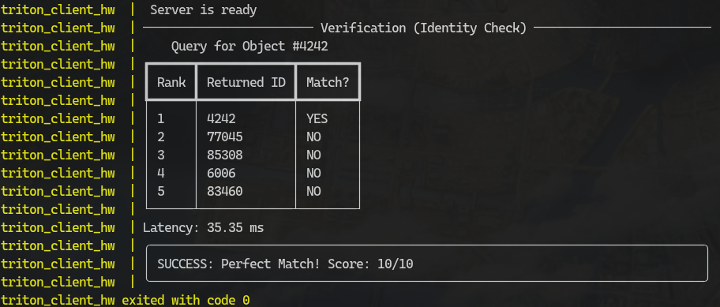

# MLOps: Векторный поиск (NVIDIA Triton + FAISS). Бонусное задание.

## Что сделано?

Сделал масштабируемый сервис для семантического поиска (RAG-backend) по базе из **100 000 векторов**. Работает в Docker-контейнерах и проводит поиск с низкой задержкой на CPU.

## По шагам

* **Сборка Docker-инфраструктуры**: Есть 2 контейнера (сервер Triton и клиент-тестер) с использованием `docker-compose`.
* **Оптимизация под CPU**: Для стабильной сборки и работы без GPU использован `torch-cpu` и `faiss-cpu`.
* **Автоматизация Model Repository**: Есть скрипт для генерации синтетических эмбеддингов и создания структуры репо для Triton.
* **Python Backend**: Поиск на стороне Triton: принимает вектор запроса, возвращает ID топ-N похожих объектов.
* **Обработка размерностей**: Настроен динамический батчинг и align размерностей тензоров между клиентом и сервером.

## 📊 Результаты

* **Объем базы**: 100 000 векторов (384-d).
* **Точность**: 100% (Identity Check пройден успешно).
* **Latency**: ~45-50 мс на запрос.

### Скриншот работы системы (Identity Check):


---

### Как запустить:

```bash
docker-compose up --build
```
